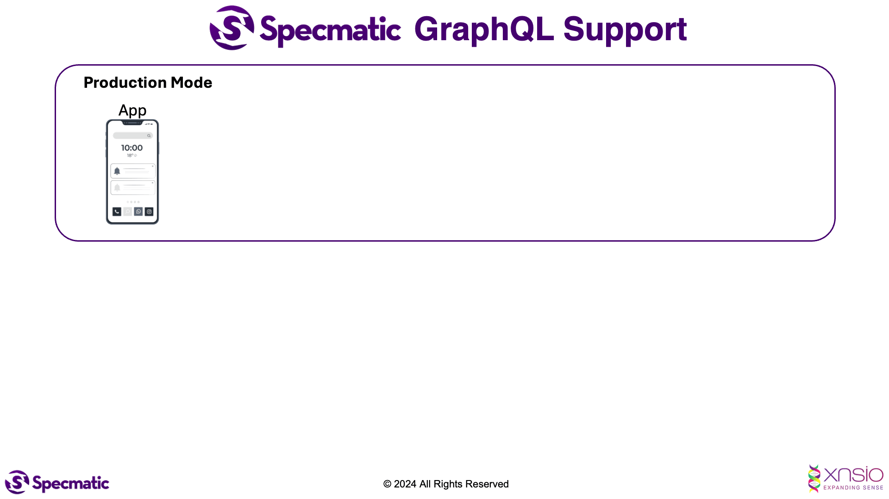

# GraphQL Contract Testing Using Specmatic

* [Specmatic Website](https://specmatic.io)
* [Specmatic Documentation](https://docs.specmatic.io)

This sample project demonstrates how we can practice contract-driven development and contract testing in a GraphQL (Kotlin) API that depends on an external domain service. Here, Specmatic is used to stub calls to domain API service based on its OpenAPI specification.

### Starting the server

- On Unix and Windows Powershell:

```shell
./gradlew bootRun
```

- On Windows CMD Prompt:

```shell
gradlew bootRun
```

You'll need the backend product API server running for this to work. You can get it from [here](https://github.com/specmatic/specmatic-order-api-java).
The README.md file in the repo contain instructions for starting up the backend API server.

Visit http://localhost:8080/graphiql to access the GraphiQL interface.

### Running the contract tests using Docker

#### 1. Start the Specmatic http stub server

- On Unix and Windows Powershell:

```shell
docker run --rm -p 8090:8090 -v "$(pwd)/specmatic.yaml:/usr/src/app/specmatic.yaml" specmatic/specmatic virtualize --port=8090
```

- On Windows CMD Prompt:
```shell
docker run --rm -p 8090:8090 -v "%cd%/specmatic.yaml:/usr/src/app/specmatic.yaml" specmatic/specmatic virtualize --port=8090
```

#### 2.a Build and run the BFF service (System Under Test) in a Docker container

```shell
docker build --no-cache -t specmatic-order-bff-graphql .
```

Then run the built image:

```shell
docker run -p 8080:8080 specmatic-order-bff-graphql
```

#### 2.b Build and run the BFF service (System Under Test) using Gradle

- On Unix and Windows Powershell:

```shell
./gradlew bootRun
```

- On Windows CMD Prompt:

```shell
gradlew bootRun
```

#### 3. Run the contract tests using Docker

- On Unix and Windows Powershell:

```shell
docker run --rm --network host -v "$(pwd)/specmatic.yaml:/usr/src/app/specmatic.yaml" -v "$(pwd)/build/reports/specmatic:/usr/src/app/build/reports/specmatic"  -e SPECMATIC_GENERATIVE_TESTS=true specmatic/specmatic-graphql test --port=8080
```

- On Windows CMD Prompt:

```shell
docker run --rm --network host -v "%cd%/specmatic.yaml:/usr/src/app/specmatic.yaml" -v "%cd%/build/reports/specmatic:/usr/src/app/build/reports/specmatic"  -e SPECMATIC_GENERATIVE_TESTS=true specmatic/specmatic-graphql test --port=8080
```
